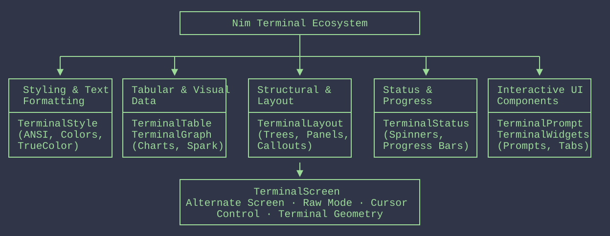
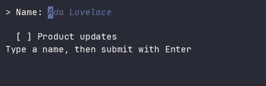

# TerminalWidgets

Pure-Nim retained models for composable terminal controls: radio groups,
switches, tabs, checkboxes, menus, text fields, scrollable lists, and keyboard
focus handling. Applications own widget references and receive typed events;
importing `terminal_widgets` performs no terminal I/O.

The public model, layout, keyboard dispatch, single-line text editing, pure
full-frame rendering, and opt-in guarded runtime are available now.

## Platform support

GitHub Actions is configured to test Nim 2.0.x and current stable Nim on Linux,
macOS, and Windows. Stable Linux additionally runs the complete suite with ARC
and ORC. Local evidence currently covers Linux; hosted jobs remain the source of
truth for other platforms. The real PTY restoration smoke is Linux-only, while
other platforms run the deterministic runtime tests.

## Requirements

- Nim 2.0.0 or newer
- [`terminal_style`](https://github.com/titanomachy/terminal-style) 0.1.1 or newer
- [`terminal_screen`](https://github.com/titanomachy/terminal-screen) 0.1.1 or newer

## TerminalDeck

TerminalWidgets is the retained interaction library in TerminalDeck:

```text
TerminalDeck
├── Foundations
│   ├── TerminalStyle
│   └── TerminalScreen
├── Output components
│   ├── TerminalStatus
│   ├── TerminalLayout
│   ├── TerminalTable
│   └── TerminalGraph
└── Interaction
    ├── TerminalPrompt
    └── TerminalWidgets <- this package
```



## Contents

- [Installation](#installation)
- [Quick start](#quick-start)
- [API overview](#api-overview)
  - [IDs and geometry](#ids-and-geometry)
  - [Retained widget state](#retained-widget-state)
  - [Keyed controls and composition](#keyed-controls-and-composition)
  - [Layout and focus routing](#layout-and-focus-routing)
  - [Frames, themes, and static text](#frames-themes-and-static-text)
  - [Interactive runtime](#interactive-runtime)
  - [Input and output events](#input-and-output-events)
- [Examples](#examples)
- [Guides](#guides)
- [Development and documentation](#development-and-documentation)
- [Release information](#release-information)
- [Attribution and license](#attribution-and-license)

## Installation

During development, install directly from GitHub with Nimble:

```sh
nimble install https://github.com/titanomachy/terminal-widgets
```

Then import the public facade:

```nim
import terminal_widgets
```

The facade re-exports normalized input types from TerminalScreen's types-only
module. It does not import session or platform code.

## Quick start

Create a retained control, lay it out, dispatch normalized input, and render a
pure frame:

```nim
import terminal_widgets

let control = newCheckbox(newWidgetId("updates"), "Install updates")
let tree = newWidgetTree(control)
discard tree.layout(newSize(24, 1))
discard tree.dispatch(keyInput(keySpace))
echo tree.render(newSize(24, 1), plainWidgetTheme()).rows[0]
```

Run the complete example with:

```sh
nim r --path:src examples/checkbox.nim
```

## API overview

| Area | Main API | Contract |
| --- | --- | --- |
| [IDs and geometry](#ids-and-geometry) | `WidgetId`, `ItemId`, `Rect`, `Size` | Validated stable IDs and nonnegative cell geometry |
| [Retained widget state](#retained-widget-state) | `Widget`, common getters/setters, `revision` | Private mutable state; same-value setters do not revise |
| [Keyed controls and composition](#keyed-controls-and-composition) | control constructors, `ChoiceItem`, `TabPage`, row/column/stack, `WidgetTree` | Stable application keys, snapshot collections, retained widget identity |
| [Text editing](#text-editing) | `TextField`, `TextValidator`, `editingBoundaries` | UTF-8 cluster-safe editing, scalar limits, validation, cell viewport |
| [Frames and themes](#frames-themes-and-static-text) | `Frame`, `CursorCell`, `WidgetTheme`, `StaticText`, `render` | Pure exact-size compositing, safe clipping, semantic styles, optional cursor |
| [Interactive runtime](#interactive-runtime) | `runWidgets`, `RuntimeOptions`, `RuntimeEventContext`, `RunResult` | Explicit owned/borrowed TerminalScreen lifecycle and full-frame loop |
| [Input and output events](#input-and-output-events) | `InputEvent`, `WidgetEvent`, `DispatchResult` | Normalized input and ordered typed application output |

### IDs and geometry

Use `newWidgetId` and `newItemId` for nonempty IDs. The two distinct types stop
widget and item identities from being mixed accidentally. Every public control
constructor validates its ID again, including values created with an explicit
distinct-type conversion.

`newRect(x, y, width, height)` accepts zero-based positions and nonnegative
dimensions, including zero space, and rejects overflowing extents. `newSize`
likewise accepts nonnegative viewport dimensions.

### Retained widget state

All controls derive from `Widget`. Common getters expose `id`, `visible`,
`enabled`, `label`, optional `helpText`, and `revision`. Setters validate before
mutation and increment the revision only when a value changes. Programmatic
setters do not synthesize user events.

Control-specific state currently includes:

- `checked` / `setChecked` for `Checkbox`
- `isOn` / `setOn` for `Switch`
- `selected` / `setSelected` for `RadioGroup`
- `selected` for `ScrollList` and `active` for `Menu` and `Tabs`
- `value` / `setValue` for `TextField`

Checkboxes and switches toggle on Space or Enter and expose stable plain markers
(`[ ]`/`[x]` and `[off]`/`[on]`). Radio groups keep an `active` navigation item
separate from the optional `selected` value: Up/Down and Home/End move across
enabled choices, while Space or Enter selects the active choice. User value
transitions return exactly one typed event; programmatic setters return none.
`renderControl` produces deterministic semantic lines for these controls with
either `plainWidgetTheme()` or styled `defaultWidgetTheme()` output. `render`
composes those controls into a clipped full-tree frame.

Scrollable lists and menus share stable `ChoiceItem` navigation and a `topIndex`
viewport offset. Up/Down, Home/End, and PageUp/PageDown skip disabled items and
keep the active row visible. List movement changes `selected`; menu movement
changes `active`, while only Enter emits an `activated` menu event. `setItems`
preserves enabled IDs across reorder/rename and otherwise chooses the specified
forward-then-backward fallback. Application payloads remain in maps keyed by
`ItemId`.
`visibleItems` and `renderControl` inspect only the allocated slice. For
performance verification, the `RenderMetrics.visitedItems` overload reports the
number of rows visited; rendering five rows from a 100,000-item fixture visits
exactly five items. Replacement remains O(n), while steady rendering is
O(visible rows).

Tabs retain keyed page roots and reserve one allocated row for their header.
Left/Right and Home/End move among enabled headers; the active page alone enters
layout and depth-first focus traversal. Header scrolling is measured in display
cells and keeps the active header start visible when a single label is wider
than the viewport. `renderControl` returns the clipped one-row semantic header;
plain output uses brackets for the active page and parentheses for disabled
pages. Inactive page widgets keep editor values, selections, and scroll offsets
across tab changes.

### Text editing

`newTextField` accepts a valid UTF-8 value and optional `placeholder`, positive
`maxRunes` (default `4096` Unicode scalars), `readOnly` flag, and
`TextValidator`. Values and inserted text reject malformed UTF-8, C0/C1
controls, and DEL atomically. The byte-offset `cursorByte` always rests on a
bounded editing cluster boundary; Left/Right, Backspace, and Delete keep
combining marks, variation selectors, emoji modifiers, ZWJ sequences, and
regional-indicator pairs together. `Home` and `End` clamp to the value edges.

`keyText` and `keySpace` insert when Ctrl/Alt are absent. Successful edits emit
one `textChanged` event; navigation only requests rendering. Read-only fields
remain focusable and can navigate or submit, while editing keys are ignored.
Tab and Backtab are left for the tree focus manager. `maxRunes` counts scalars,
not UTF-8 bytes, graphemes, or terminal cells, and an insertion that would
exceed it is rejected without truncation.

Enter invokes the optional validator exactly once. Return `none(string)` to
emit `submitted`; return `some(message)` to emit `validationFailed` and expose a
sanitized `validationError` without changing focus or text. Validator exceptions
propagate to the caller's runtime cleanup path. Validators must not mutate the
widget tree while dispatch is in progress. A later successful edit or setter
clears the old error. The placeholder is shown only while the value is empty and
is never submitted.

After layout, `contentWidth` reserves marker/label cells. `horizontalOffset`
scrolls in terminal cells just enough to keep the cursor visible, leaving one
blank caret cell at End when possible. `cursorCell` is an optional frame-local
zero-based column and is absent when the field has no visible content cell.
`visibleText(width)` uses TerminalStyle's cell-aware clipping and never splits a
wide glyph. The public `editingBoundaries` helper documents the deliberately
bounded segmentation policy used by the field.

### Keyed controls and composition

`ChoiceItem` and `TabPage` keep labels separate from stable `ItemId` keys.
Duplicate item/page IDs and selections targeting missing or disabled choices are
rejected. Collection getters return independent sequence storage, while widget
references intentionally preserve identity.

Use `setPages` to replace or reorder pages while tabs are detached. Once tabs
belong to a tree, call `replacePages(tree, tabs.id, pages)`: it preserves an
enabled active ID when possible, otherwise searches from the old position
forward and then backward. Removed page roots release ownership, newly added
roots are validated atomically, and focus is repaired if its page disappears.

`newRow`, `newColumn`, and `newStack` create retained containers. Detached
containers may replace their children atomically with `setChildren`; duplicate
references, duplicate widget IDs, cycles, and already-owned widgets are rejected
without changing the container. `newWidgetTree` validates the complete graph and
takes exclusive ownership. Tree-managed structural mutation, allocation, and
focus handling preserve retained values and repair invalid focus.

### Input and output events

TerminalScreen's `InputEvent`, `KeyEvent`, `Key`, and modifier types are
available from the facade. `WidgetEvent` is a tagged object with a source
`WidgetId` and exactly one payload selected by its kind:

| Kind | Payload |
| --- | --- |
| `boolChanged` | New Boolean value |
| `selectionChanged` | Optional selected `ItemId` |
| `textChanged` | New text |
| `activated` | Activated `ItemId` |
| `submitted` | Submitted field text |
| `validationFailed` | Plain validation message |
| `focusChanged` | Previous and new optional `WidgetId` values |

`DispatchResult` carries `handled`, `needsRender`, and an ordered event sequence.
Routing and controls return these events directly to the application or runtime.

### Layout and focus routing

Rows and columns allocate visible children along their main axis; stacks give
each visible child the same content rectangle. Configure nonnegative padding and
gaps with `setPadding` and `setGap`, and set direct children to `fixed(cells)` or
positive `flex(weight)` sizing with `setSizing`. Calling `layout(tree, size)`
stores clipped cell allocations without querying the terminal.

Each tree owns an independent depth-first focus order. Eligible controls must be
effectively visible, enabled, and allocated nonzero space. `requestFocus` rejects
ineligible IDs atomically. `dispatch` handles Tab and Backtab with wrapping,
routes other normalized input to the focused widget, and bubbles unhandled input
through its ancestors. Fixed per-control key bindings are listed in the
[behavior guide](docs/behavior.md#fixed-key-bindings).

Use `detach(tree, id)` to remove a non-root subtree and release its tree
ownership, `attach(tree, parentId, widget)` to add a validated detached subtree,
and `move(tree, id, newParentId)` to reparent an owned subtree atomically. These
operations retain widget objects and values and repair focus against the latest
layout size.

### Frames, themes, and static text

Call `layout(tree, size)` and then `render(tree, size, theme)` to produce a pure
`Frame` with exactly `height` rows of display width `width`. A focused visible
text field may set the optional zero-based `CursorCell`; frame rows never contain
cursor movement or erase commands. Rendering rejects a mismatched or detectably
stale layout, performs no terminal I/O, and does not mutate widget revisions.

`plainWidgetTheme()` emits no ANSI escapes. `defaultWidgetTheme()` uses semantic
normal, focused, disabled, selected, placeholder, error, and accent styles with
ASCII markers; `unicodeWidgetTheme()` opts into Unicode markers. Custom markers
are measured by terminal cells and must be printable, single-line, positive-width
text. Labels, items, placeholders, and errors are treated as untrusted plain text:
malformed UTF-8 becomes U+FFFD and terminal controls become spaces.

`newStaticText` safely composes ordinary application or companion-library string
output without adding that library as a dependency. Use the explicitly named
`newTrustedStyledText` only for content that may retain SGR styling; the renderer
still strips OSC, cursor, erase, and other terminal protocols. Wide glyphs are
never cut in half, later stack children overwrite their complete rectangles, and
all output rows close generated styles. Full-frame presentation is the baseline;
diff rendering is intentionally deferred until measurement justifies it.

```nim
let size = newSize(24, 2)
discard tree.layout(size)
let frame = tree.render(size, plainWidgetTheme())
for row in frame.rows:
  echo row
```

Run the complete example with:

```sh
nim r --path:src examples/render_frame.nim
```

### Interactive runtime

Import `terminal_widgets/runtime` explicitly to opt into terminal I/O.
`runWidgets(tree, options, onEvents)` opens one TerminalScreen session, verifies
interactive ANSI/raw capabilities, obtains geometry (or uses the configured
80×24 fallback), owns alternate-screen/cursor/autowrap modes, presents complete
frames, and restores every acquired stage before closing. Ctrl+C returns
`cancelled`, EOF returns `endOfInput`, and an event handler returning `stopRunning`
returns `requestedStop`; exceptions remain exceptions after cleanup.

The handler receives each dispatched input plus its ordered `WidgetEvent`
outcome. Unhandled keys, including Escape, are delivered there instead of being
silently discarded. Application mutations made after dispatch cause one layout
and redraw. Timeout polls do not redraw, resize forces a full layout/frame, and
`pollTimeoutMs` must be in `1..60000`.

The borrowed overload accepts an open `TerminalSession` and its exact matching
output `File`—a necessary caller precondition because TerminalScreen 0.1.1 has no
public output getter. It never opens or closes the session. By default it also
leaves screen, cursor, and autowrap ownership with the caller; opt into
`ownBorrowedPresentation` only when the known baseline is the normal screen,
visible cursor, and enabled autowrap. Uncatchable process termination remains
outside the cleanup guarantee.



The animation’s reproducible source is
[`docs/recordings/interactive_form.cast`](docs/recordings/interactive_form.cast).

```nim
import terminal_widgets/runtime

let result = runWidgets(tree,
  onEvents = proc(context: RuntimeEventContext): RunAction =
    for event in context.outcome.events:
      if event.kind == submitted:
        return stopRunning
    continueRunning)
```

Compile the interactive example with:

```sh
nim c --path:src examples/interactive_form.nim
```

## Examples

The repository includes these runnable examples:

- [`examples/checkbox.nim`](examples/checkbox.nim),
  [`examples/switch.nim`](examples/switch.nim), and
  [`examples/radio_group.nim`](examples/radio_group.nim) demonstrate the Boolean
  and exclusive-choice controls.
- [`examples/scroll_list.nim`](examples/scroll_list.nim) and
  [`examples/menu.nim`](examples/menu.nim) demonstrate keyed navigation and the
  menu's explicit activation event.
- [`examples/tabs.nim`](examples/tabs.nim) demonstrates active-page layout and
  [`examples/text_field.nim`](examples/text_field.nim) demonstrates editing.
- [`examples/headless_form.nim`](examples/headless_form.nim) runs the finite
  mixed-widget form used by compatibility checks without requiring a TTY.
- [`examples/form.nim`](examples/form.nim) is the guarded interactive form;
  Enter submits and exits, Escape exits, and Ctrl+C cancels.
- [`examples/core_model.nim`](examples/core_model.nim) constructs and updates a
  retained preferences tree using only the facade.
- [`examples/composition_focus.nim`](examples/composition_focus.nim) demonstrates
  fixed/flex layout, stored allocations, and focus traversal without terminal I/O.
- [`examples/basic_controls.nim`](examples/basic_controls.nim) drives checkbox,
  switch, and radio state through the public dispatcher and prints final values.
- [`examples/selection_navigation.nim`](examples/selection_navigation.nim)
  demonstrates shared list/menu navigation and explicit menu activation.
- [`examples/tabs_retained.nim`](examples/tabs_retained.nim) switches between
  three retained pages, prints a semantic header, and demonstrates preserved
  state plus tree-managed page removal and reordering.
- [`examples/text_field_editing.nim`](examples/text_field_editing.nim) exercises
  Unicode-safe insertion/deletion, a scalar limit, placeholder text, and
  validator/submission events without opening a terminal.
- [`examples/validated_form.nim`](examples/validated_form.nim) composes two
  validated fields, reports failed and successful submissions, and moves focus
  through the form using only the public facade.
- [`examples/render_frame.nim`](examples/render_frame.nim) lays out a small form,
  renders an exact-size plain frame, and reports its optional cursor metadata.
- [`examples/companion_output.nim`](examples/companion_output.nim) places static
  graph-like string output in a frame without adding a companion dependency.
- [`examples/interactive_form.nim`](examples/interactive_form.nim) runs a small
  validated form through the owned TerminalScreen lifecycle in a real terminal.
- [`examples/runtime_demo.nim`](examples/runtime_demo.nim) is the finite injected
  runtime sequence used to regenerate the README animation deterministically.
- [`examples/package_import.nim`](examples/package_import.nim) verifies that a
  facade import does not initialize a terminal session.

Most examples are side-effect-free. The interactive form opts into a real
terminal session; its finite deterministic counterpart produces the checked-in
animation above.

## Guides

- [`docs/api.md`](docs/api.md) maps public types, constructors, state, composition,
  rendering, runtime entry points, and their standalone examples.
- [`docs/behavior.md`](docs/behavior.md) defines key bindings, state ownership,
  Unicode boundaries, themes, validation, and error behavior.
- [`docs/runtime.md`](docs/runtime.md) defines owned/borrowed sessions, cleanup,
  termination, failures, and single-owner companion-output composition.

## Development and documentation

Repository builds are contained in `build/`: executables go to `build/bin`,
compiler caches use a Nim-version and project-specific directory below
`build/nimcache`, generated API documentation goes to `build/docs`, and test
fixtures belong in `build/tmp`.

Run the focused public-model suite with:

```sh
nim c -r --path:src tests/test_core_model.nim
```

Run all package checks with:

```sh
nimble check
nimble compilePackage
nimble test
nimble testArc
nimble testOrc
nimble packageTest
nimble examples
nimble headlessExample
nimble docs
nimble releaseCheck
```

`nimble benchmark` writes the reproducible 100,000-item release benchmark to
`build/reports/large_list_benchmark.md`. Seeded robustness tests print the exact
seed and step on failure. Platform scope, local results, and reproduction details
are recorded in verification records.

Command-line `--out` and `--nimcache` overrides take precedence over
`config.nims`; project automation must keep any such paths below `build/`.

## Release information

The candidate’s compatibility evidence and exact reproduction commands are in
release records. See
[`RELEASE_NOTES.md`](RELEASE_NOTES.md) for the 0.1.0 highlights and known limits.
The final engineering assessment and tracked findings are in
the final engineering assessment. Tagging and package publication
remain explicit repository-owner actions.

## Attribution and license

Copyright (c) 2026 titanomachy. TerminalWidgets is released under the
[MIT License](LICENSE). The separately distributed MIT-licensed dependencies
are listed in [`THIRD_PARTY_NOTICES.md`](THIRD_PARTY_NOTICES.md).
